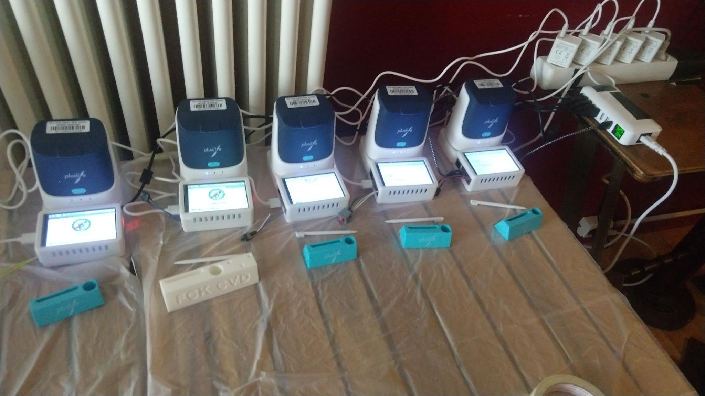

# Pluslife Companion

Uses a Raspberry Pi (>=2) to interface with the [Pluslife NAAT](virus.sucks/pluslife) in order to streamline testing.

## Components

The setup consists of the following parts:

Hardware:
- Raspberry Pi. 2++ (armv7++), as a Pi 1 a) has problems with RAM for running chrome and b) difficulties running the display
- A 3.5 inch touchscreen (XPT2046 / ADS7846). 480x320 is too small for comfort, but its cheap and works (with hacks)
- A hardware button on GPIO to press `Return`, as the 320px are too small in chrome dialogs to confirm serial port connections...

Software (described and automated [below](#Setup)):
- Any Raspbian (32bit armhf) working for your Raspberry Pi.
- The display drivers (https://github.com/goodtdt/LCD-Show)
- Hardware button config in /boot/config.txt
- A saved version of the Pluslife Analyzer website which this project wraps in Hardware.
- Chromium.desktop application shortcut with autostart

## Image Build

1. Needs the Raspberry Pi OS Legacy (Bookworm) 32bit!
2. Use rpi-imager to install on a SD card, set username+password (to skip first run wizard), set Wifi and set Hostname

## Setup

1. Start the Pi and wait for it to boot. Make sure the Pi is connected to the Internet. Then, either:
   1. Via SSH: Login as `pi@<hostname>`, run `sudo su` to change to root
   2. Via Keyboard+Mouse+Display: It should autologin to Desktop, open the Terminal from the Top-Panel and type `sudo su` to change to root
2. Copy the `setup.sh` to the Pi into the home directory of the pi user.
3. Run setup by `. /home/pi/setup.sh`. After the setup, reboot. It should then show the Desktop on the touchscreen.
   If it doesn't, stuff gets complicated and you're out of luck with this tutorial...
4. Optional but recommended: Open the Menu in the top-left, select Preferences->Appearance Settings.
    In the Defaults-Tab, click "For small screens" to reduce clutter.

## Hardware

Besides a Raspberry Pi and a Pluslife device, you can 3D print a case to have a more clean build, so it could look like this:

The build is based on 3 parts:

1. [The main build](res/3d_case_3b.stl). It is a remix of [the modular snap raspberry Pi case from printables.com](https://www.printables.com/model/106225-modular-snap-together-raspberry-pi-2b3b3b4-case-w-/files) in the Raspberry Pi 3b version. You can easily exchange for other versions.
2. [The top case](res/3d_top_3b.stl). This is just a copy of [this](https://www.printables.com/model/280272-raspberry-pi-3b-35-screen-top-case).
3. [A RJ45-hat](res/3d_LAN_top.stl). Put it over the LAN-port to make it bigger and support the display without it bending. 

## Troubleshooting

- if the first run wizard is on screen so the taskbar is not shown: you need to set a username+password in your image, so the first run wizard is skipped